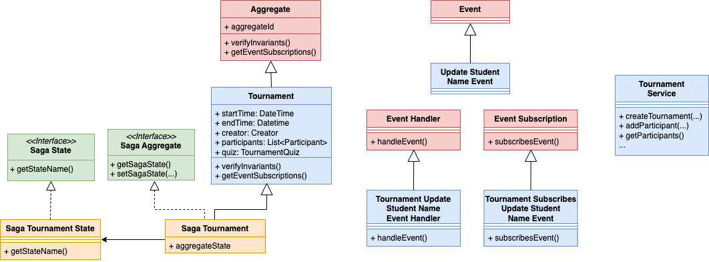
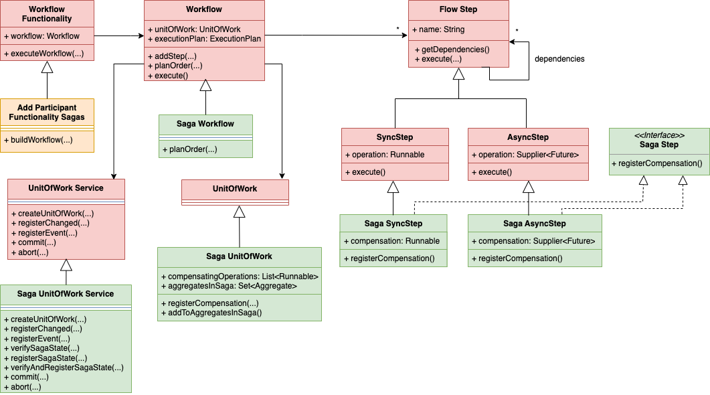

# Microservices Simulator

The artifact supports the test of business logic of a microservices application designed on the concept of Domain-Driven Design Aggregate and using several transactional models. 

The currently supported transactional models are: 

* Eventual Consistency
  * Sagas applying the Orchestration variant
* Transactional Causal Consistency

The system allows testing the interleaving of functionalities execution in a deterministic context, such that it is possible to evaluate the resulting behavior.

The description of the examples for Transactional Causal Consistency are in [Transactional Causal Consistent Microservices Simulator](https://doi.org/10.1007/978-3-031-35260-7_4).

## Run Using Docker

### Technology Requirements

- [Docker Compose V2] (https://docs.docker.com/compose/install/)

### Usage

* Build the application
```
docker compose build
```

* Running Quizzes Microservices Simulator: Sagas and TCC
```
docker compose up quizzes-sagas
docker compose up quizzes-tcc
```

* Running Tests: Simulator Sagas, Quizzes Sagas, Quizzes TCC
```
docker compose up test-simulator-sagas
docker compose up test-quizzes-sagas
docker compose up test-quizzes-tcc
```

## Run Using Maven

### Technology Requirements

- [Maven 3.9.9](https://archive.apache.org/dist/maven/maven-3/3.9.9/)

- [Java 21+](https://openjdk.org/projects/jdk/21/)

- [PSQL 14](https://www.postgresql.org/download/)

- [JMeter 5.6](https://jmeter.apache.org/download_jmeter.cgi)

### Setting up the database
* Start db
```
sudo service postgresql start
sudo su -l postgres
dropdb msdb
createdb msdb
```
* Create user to access db
```
psql msdb
CREATE USER your-username WITH SUPERUSER LOGIN PASSWORD 'yourpassword';
\q
exit
```
* Copy `backend/src/main/resources/application-dev.properties.example` to `application-dev.properties` and fill the placeholder fields.
* If you have run the unit-test using docker, `backend/target` directory may be with root owner and group, do: `sudo rm -rf backend/target`.

### Simulator
```
cd simulator
```
#### Run simulator tests
```
mvn clean -Ptest-sagas test
```
#### Install simulator library
```
mvn clean install
```
### Quizzes Microservice System Simulation
```
cd applications/quizzes
```
#### Launch simulator for Sagas
```
mvn clean -Psagas spring-boot:run
```
#### Launch simulator for TCC
```
mvn clean -Ptcc spring-boot:run
```
#### Running Sagas Tests
```
mvn clean -Ptest-sagas test
```
##### Running TCC Tests
```
mvn clean -Ptest-tcc test
```

* Some Sagas test cases:
  * [Workflow Test Plan (Simulator)](simulator/src/test/groovy/pt/ulisboa/tecnico/socialsoftware/ms/sagas/workflow/PlanOrderTest.groovy)
  * [Tournament Functionality Tests (Quizzes)](applications/quizzes/src/test/groovy/pt/ulisboa/tecnico/socialsoftware/quizzes/sagas/coordination/)


* Some TCC test cases:
  * [Tournament Merge Tests (Quizzes)](applications/quizzes/src/test/groovy/pt/ulisboa/tecnico/socialsoftware/quizzes/causal/aggregates/TournamentMergeUnitTest.groovy)
  * [Tournament Functionality Tests (Quizzes)](applications/quizzes/src/test/groovy/pt/ulisboa/tecnico/socialsoftware/quizzes/causal/coordination/TournamentFunctionalityCausalTest.groovy)

## Code structure

### Simulator

* The core concepts of [Domain-Driven Design](simulator/src/main/java/pt/ulisboa/tecnico/socialsoftware/ms/domain)
* The core concepts for the distributed functionalities [Coordination](simulator/src/main/java/pt/ulisboa/tecnico/socialsoftware/ms/coordination)
* The core concepts for management of [Sagas](simulator/src/main/java/pt/ulisboa/tecnico/socialsoftware/ms/sagas)
* The core concepts for management of [TCC](simulator/src/main/java/pt/ulisboa/tecnico/socialsoftware/ms/causal)

### Quizzes Microservice System

* A case study for [Quizzes Tutor](applications/quizzes/src/main/java/pt/ulisboa/tecnico/socialsoftware/quizzes)
    * The transactional model independent [Microservices](applications/quizzes/src/main/java/pt/ulisboa/tecnico/socialsoftware/quizzes/microservices)
    * The Sagas implementation for
      * [Aggregates](applications/quizzes/src/main/java/pt/ulisboa/tecnico/socialsoftware/quizzes/sagas/aggregates)
      * [Coordination](applications/quizzes/src/main/java/pt/ulisboa/tecnico/socialsoftware/quizzes/sagas/coordination)
    * The TCC implementation for
      * [Aggregates](applications/quizzes/src/main/java/pt/ulisboa/tecnico/socialsoftware/quizzes/causal/aggregates)
      * [Coordination](applications/quizzes/src/main/java/pt/ulisboa/tecnico/socialsoftware/quizzes/causal/coordination)
* The tests of the [Quizzes Tutor](applications/quizzes/src/test/groovy/pt/ulisboa/tecnico/socialsoftware/quizzes) for
  * [Sagas](applications/quizzes/src/test/groovy/pt/ulisboa/tecnico/socialsoftware/quizzes/sagas/coordination)
  * [TCC Aggregates](applications/quizzes/src/test/groovy/pt/ulisboa/tecnico/socialsoftware/quizzes/causal/aggregates)
  * [TCC Coordination](applications/quizzes/src/test/groovy/pt/ulisboa/tecnico/socialsoftware/quizzes/causal/coordination)

## How to implement and test your own business logic for Sagas (Illustrated with Quizzes Microservice System)

The figure shows the main classes to be extended for aggregates, their events and services. The classes in red belong to 
the domain-driven design concepts, and the classes green corresponds to the transaction model specific classes. 
Classes in blue are the domain-specific extensions, in this case for the quizzes case study, and the classes in orange 
it is their transactional model specific extension.



Apply the following steps to define a domain-specific aggregate, its events and services, here illustrated with
the Quizzes Tutor system and its Tournament aggregate.

For the transactional model independent part:
1. **Define Aggregate**: Each microservice is modeled as an aggregate. The first step is to define the aggregates.
   The simulator uses Spring-Boot and JPA, so the domain entities definition uses the JPA notation.
   In [Tournament](applications/quizzes/src/main/java/pt/ulisboa/tecnico/socialsoftware/quizzes/microservices/tournament/aggregate/Tournament.java#L75)
   aggregate we can see the aggregate root entity and the reference to its internal entities.
2. **Specify Invariants**: The aggregate invariants are defined by overriding method [verifyInvariants()](applications/quizzes/src/main/java/pt/ulisboa/tecnico/socialsoftware/quizzes/microservices/tournament/aggregate/Tournament.java#L283).
3. **Define Events**: Define the events published by upstream aggregates and subscribed by downstream aggregates, like [UpdateStudentNameEvent](applications/quizzes/src/main/java/pt/ulisboa/tecnico/socialsoftware/quizzes/microservices/execution/events/publish/UpdateStudentNameEvent.java#L6).
4. **Subscribe Events**: The events published by upstream aggregates can be subscribed by overriding method [getEventSubscriptions()](applications/quizzes/src/main/java/pt/ulisboa/tecnico/socialsoftware/quizzes/microservices/tournament/aggregate/Tournament.java#L156).
5. **Define Event Subscriptions**: Events can be subscribed depending on its data. Therefore, define subscription classes like [TournamentSubscribesUpdateStudentName](applications/quizzes/src/main/java/pt/ulisboa/tecnico/socialsoftware/quizzes/microservices/tournament/events/subscribe/TournamentSubscribesUpdateStudentName.java#L10).
6. **Define Event Handlers**: For each subscribed event define an event handler that delegates the handling in a handling functionality, like [UpdateStudentNameEventHandler](applications/quizzes/src/main/java/pt/ulisboa/tecnico/socialsoftware/quizzes/microservices/tournament/events/handling/handlers/UpdateStudentNameEventHandler.java#L8)
   and its handling functionality [processUpdateStudentNameEvent(...)](applications/quizzes/src/main/java/pt/ulisboa/tecnico/socialsoftware/quizzes/coordination/eventProcessing/TournamentEventProcessing.java#L106).
7. **Define Aggregate Services**: Define the microservice API, whose implementation interact with the unit of work to register changes and publish events, like service [updateExecutionStudentName(...)](applications/quizzes/src/main/java/pt/ulisboa/tecnico/socialsoftware/quizzes/microservices/execution/service/CourseExecutionService.java#L196).

For the transactional model dependent part:
1. **Define Saga Aggregates**: Extend aggregates with the information required for semantic locks, like [SagaTournament](applications/quizzes/src/main/java/pt/ulisboa/tecnico/socialsoftware/quizzes/sagas/aggregates/SagaTournament.java#L18) and its [Semantic Lock](applications/quizzes/src/main/java/pt/ulisboa/tecnico/socialsoftware/quizzes/sagas/aggregates/states/TournamentSagaState.java#L5).

To define the system functionalities, it is necessary to extend the simulator part for coordination. 



For the functionalities:
1. **Define Functionalities**: Functionalities coordinate the execution of aggregate services using sagas, like functionality [AddParticipantFunctionalitySagas(...)](applications/quizzes/src/main/java/pt/ulisboa/tecnico/socialsoftware/quizzes/sagas/coordination/tournament/AddParticipantFunctionalitySagas.java#L19)

To write tests:
1. **Design Test Cases**: Define tests cases for the concurrent execution of functionalities deterministically enforcing execution orders, like in the [Concurrent Execution of Update Name and Add Participant](applications/quizzes/src/test/groovy/pt/ulisboa/tecnico/socialsoftware/quizzes/sagas/coordination/AddParticipantAndUpdateStudentNameTest.groovy#L27). Directory [coordination](applications/quizzes/src/test/groovy/pt/ulisboa/tecnico/socialsoftware/quizzes/sagas/coordination/) contains the test of more complex interleavings using the sagas transactional model. 


## Running JMeter tests

* After starting application with the tcc profile, either using Docker or Maven, and installing JMeter

```
cd applications/quizzes/jmeter/tournament/thesis-cases/
jmeter -n -t TEST.jmx
```

* Some test cases:
  * [5a-updateStudentName-addParticipant-processUpdateNameEvent.jmx](applications/quizzes/jmeter/tournament/thesis-cases/5a-updateStudentName-addParticipant-processUpdateNameEvent.jmx)
  * [5b-addParticipant-updateStudentName-processUpdateNameEvent.jmx](applications/quizzes/jmeter/tournament/thesis-cases/5b-addParticipant-updateStudentName-processUpdateNameEvent.jmx)
  * [5c-updateStudentName1-addParticipant-updateStudentName2-processUpdateNameEvent.jmx](applications/quizzes/jmeter/tournament/thesis-cases/5c-updateStudentName1-addParticipant-updateStudentName2-processUpdateNameEvent.jmx)
  * [5d-addParticipant1-updateStudentName-processUpdateNameEvent1-addParticipant2-processUpdateNameEvent2.jmx](applications/quizzes/jmeter/tournament/thesis-cases/5d-addParticipant1-updateStudentName-processUpdateNameEvent1-addParticipant2-processUpdateNameEvent2.jmx)
  * [8-5-update-tournament-concurrent-intention-pass.jmx](applications/quizzes/jmeter/tournament/thesis-cases/8-5-update-tournament-concurrent-intention-pass.jmx)
  * [8-6-add-participant-concurrent-update-execution-student-name-processing-ends-first.jmx](applications/quizzes/jmeter/tournament/thesis-cases/8-6-add-participant-concurrent-update-execution-student-name-processing-ends-first.jmx)
  * [8-7-add-participant-concurrent-anonymize-event-processing-processing-ends-last.jmx](applications/quizzes/jmeter/tournament/thesis-cases/8-7-add-participant-concurrent-anonymize-event-processing-processing-ends-last.jmx)
  * [8-8-update-execution-student-add-participant-process-event-add-participant.jmx](applications/quizzes/jmeter/tournament/thesis-cases/8-8-update-execution-student-add-participant-process-event-add-participant.jmx) 
  * [8-9-add-participant-concurrent-anonymize-event-processing-processing-ends-first.jmx](applications/quizzes/jmeter/tournament/thesis-cases/8-9-add-participant-concurrent-anonymize-event-processing-processing-ends-first.jmx)
  * [8-10-concurrent-delete-tournament-add-participant.jmx](applications/quizzes/jmeter/tournament/thesis-cases/8-10-concurrent-delete-tournament-add-participant.jmx)
### Viewing JMeter tests structure

```
cd applications/quizzes/jmeter/tournament/thesis-cases/
jmeter
```
* The command launches JMeter GUI. By clicking `File > Open` and selecting a test file it is possible to observe the test structure.
* Tests can also be run using the GUI, by clicking on the `Start` button.

## How to implement and test your own business logic for TCC

The code follows the structure in the figure, where the packages in blue and orange contain, respectively, the microservices domain specific code and the transactional causal consistency domain specific code.


The figure shows the main classes to be extended in the steps described next. 


Apply the following steps: 1-7 as for sagas (transactional model independent)

1. **Define Aggregate**: 
2. **Specify Invariants**: 
3. **Define Events**: 
4. **Subscribe Events**: 
5. **Define Event Subscriptions**: 
6. **Define Event Handlers**:
7. **Define Aggregate Services**:
8. **Define Causal Aggregates**: Extend aggregates with the information required to process merges, like [CausalTournament](applications/quizzes/src/main/java/pt/ulisboa/tecnico/socialsoftware/quizzes/causal/aggregates/CausalTournament.java#L26).
9. **Define Functionalities**: Functionalities coordinate the execution of aggregate services using TCC, like functionality [updateStudentName(...)](applications/quizzes/src/main/java/pt/ulisboa/tecnico/socialsoftware/quizzes/causal/coordination/execution/UpdateStudentNameFunctionalityTCC.java#L14), 
where each service interacts with the unit of work to register changes and publish events, like service [updateExecutionStudentName(...)](applications/quizzes/src/main/java/pt/ulisboa/tecnico/socialsoftware/quizzes/microservices/execution/service/CourseExecutionService.java#L196).
10. **Define Test Cases**: Define deterministic tests cases for the concurrent execution of functionalities using services to decrement the system version number, 
which defines functionalities execution order, and to force the deterministic processing of events, like in the [Concurrent Execution of Update Name and Add Participant](applications/quizzes/src/test/groovy/pt/ulisboa/tecnico/socialsoftware/quizzes/causal/coordination/TournamentFunctionalityCausalTest.groovy#L114).

##  Spock Tests in [DAIS2023](https://link.springer.com/chapter/10.1007/978-3-031-35260-7_4) paper - 23nd International Conference on Distributed Applications and Interoperable Systems

To reproduce the paper results follow the steps:

* Analyze a figure in the paper, fig3a-d and fig4;
* Read the test case code for the figure, including the final assertions that define the expected behavior (see below);
* Run the test case (see below);
* Read the logger INFO messages, they use UPPERCASE. They identify when a functionality and event processing starts and ends and what its version number is. 
  * For instance, in test-fig4 both functionalities start with the same version number (they are concurrent), but addParticipant finishes with a higher number, because it finishes after updateName. It can be observed in the log that an exception was thrown, due to the invariant break.


### Figure 3(a)
* [Test code](applications/quizzes/src/test/groovy/pt/ulisboa/tecnico/socialsoftware/quizzes/causal/coordination/TournamentFunctionalityCausalTest.groovy#L78-L93) 
* Run:
```
docker-compose up test-fig3a
```

### Figure 3(b)
* [Test code](applications/quizzes/src/test/groovy/pt/ulisboa/tecnico/socialsoftware/quizzes/causal/coordination/TournamentFunctionalityCausalTest.groovy#L95-L112)
* Run: 
```
docker-compose up test-fig3b
```

### Figure 3(c)
* [Test code](applications/quizzes/src/test/groovy/pt/ulisboa/tecnico/socialsoftware/quizzes/causal/coordination/TournamentFunctionalityCausalTest.groovy#L114-L133)
* Run: 
```
docker-compose up test-fig3c
```

### Figure 3(d)
* [Test code](applications/quizzes/src/test/groovy/pt/ulisboa/tecnico/socialsoftware/quizzes/causal/coordination/TournamentFunctionalityCausalTest.groovy#L135-L156)
* Run: 
```
docker-compose up test-fig3d
```

### Figure 4
* [Test code](applications/quizzes/src/test/groovy/pt/ulisboa/tecnico/socialsoftware/quizzes/causal/coordination/TournamentFunctionalityCausalTest.groovy#L236-L266)
* Run: 
```
docker-compose up test-fig4
```
