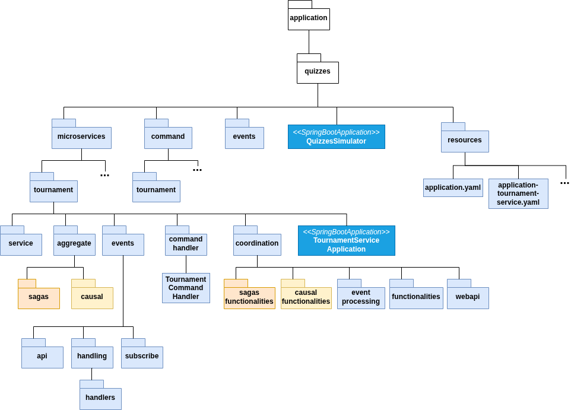
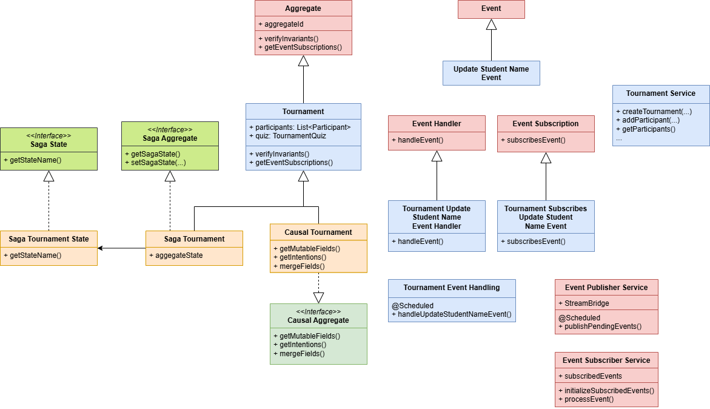
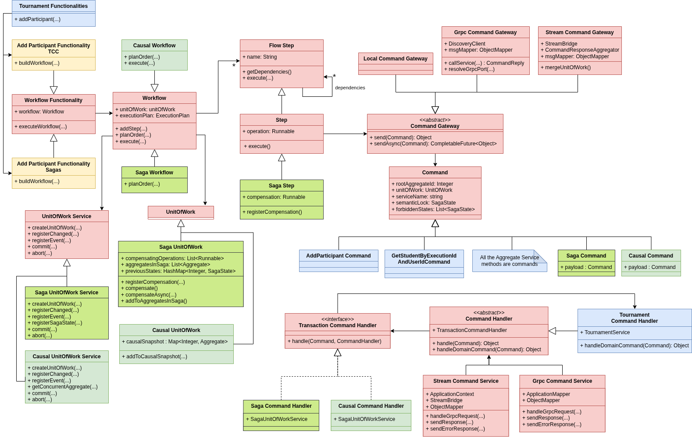

# Microservices Simulator

The artifact supports the test of business logic of a microservices application designed on the concept of Domain-Driven
Design Aggregate and using several transactional models.

The currently supported transactional models are:

* Eventual Consistency
    * Sagas applying the Orchestration variant
* Transactional Causal Consistency

The system allows testing the interleaving of functionalities execution in a deterministic context, such that it is
possible to evaluate the resulting behavior.

The description of the examples for Transactional Causal Consistency are
in [Transactional Causal Consistent Microservices Simulator](https://doi.org/10.1007/978-3-031-35260-7_4).

The simulator supports multiple execution modes to test different aspects of system behavior, ranging from simple local
execution to full distributed deployment.

| Mode                  | Description                                                                                                        | Profiles                               | Infrastructure                                                                                                               |
|-----------------------|--------------------------------------------------------------------------------------------------------------------|----------------------------------------|------------------------------------------------------------------------------------------------------------------------------|
| **Monolith (Local)**  | Runs as a single application. Service calls are internal.                                                          | `sagas` or `tcc` (`local` variant)     | PostgreSQL, Jaeger                                                                                                           |
| **Monolith (Stream)** | Single application but uses RabbitMQ for remote communication between components. Simulates distributed messaging. | `sagas,stream` or `tcc,stream`         | PostgreSQL, Jaeger, RabbitMQ                                                                                                 |
| **Microservices**     | Fully distributed. Each domain service runs independently. Uses Eureka for discovery and RabbitMQ for messaging.   | Service-specific (e.g., `answer-saga`) | PostgreSQL (**per service** in **Docker**, **centralized** with multiple databases with **Maven**), Jaeger, RabbitMQ, Eureka |
| **Kubernetes**        | Distributed microservices orchestrated by Kubernetes. Uses Spring Cloud Kubernetes for discovery.                  | `kubernetes`                           | K8s Cluster, RabbitMQ, PostgreSQL                                                                                            |

## Run Using Docker

### Technology Requirements

- [Docker Compose V2](https://docs.docker.com/compose/install/)

### Build the Application

```bash
docker compose build
```

Or run the service with the flag `--build`

### Running as a Monolith with Local Service Calls

```bash
# Sagas
docker compose up quizzes-sagas

# TCC
docker compose up quizzes-tcc
```

### Running as a Monolith with Remote Service Calls With RabbitMQ

```bash
# Sagas
docker compose up quizzes-sagas-stream

# TCC
docker compose up quizzes-tcc-stream
```

### Running as Microservices

```bash
# Sagas
docker compose build --with-dependencies gateway

# TCC
TX_MODE=tcc docker compose build --with-dependencies gateway
```

This will build the gateway and all microservices.

```bash
docker compose up gateway -d
```

Starting the gateway will automatically start the entire microservices ecosystem, including:

**Infrastructure:**

* `eureka-server`: Service discovery
* `rabbitmq`: Message broker for async communication
* `gateway`: API Gateway (entry point)

**Microservices:**

* `version-service`
* `answer-service`
* `course-service`
* `course-execution-service`
* `question-service`
* `quiz-service`
* `topic-service`
* `tournament-service`
* `user-service`

**Databases (One per service):**

* `version-db`
* `answer-db`
* `course-db`
* `execution-db`
* `question-db`
* `quiz-db`
* `topic-db`
* `tournament-db`
* `user-db`

### Running Local Tests

> **Note:** Run `build-simulator` first before running tests.

```bash
docker compose up build-simulator
```

**Simulator Sagas:**

```bash
docker compose up test-simulator-sagas
```

```bash
# Quizzes Sagas:
docker compose up test-quizzes-sagas

# Quizzes TCC:
docker compose up test-quizzes-tcc
```

---

## Run Using IntelliJ

### Technology Requirements

- [IntelliJ IDEA](https://www.jetbrains.com/idea/download/) (Ultimate or Community Edition)

### Pre-configured Run Configurations

The project includes ready-to-use IntelliJ run configurations in the `.run/` directory. After opening the project in
IntelliJ, these configurations will be automatically available in the Run/Debug dropdown.

1. Open the project in IntelliJ IDEA
2. Run the `build-simulator` configuration to install the simulator library
3. Select a run configuration from the dropdown (e.g., **Quizzes**)
4. Click the **Run** button

### Running as a Monolith with Local Service Calls

- Run the `sagas local` or the `tcc local` configuration

### Running as a Monolith with Remote Service Calls With RabbitMQ

- Run the `Quizzes SAGAS Stream` or the `Quizzes TCC Stream` configuration
- Run the `VersionServiceApplication` configuration to start the version service

### Running as Microservices

- Run the `microservices-sagas` folder or the `microservices-tcc` folder to run all the microservices
- Run the `VersionServiceApplication` configuration
- Run the `GatewayApplication` configuration to start the API gateway

---

## Run Using Maven

### Technology Requirements

- [Maven 3.9.9](https://archive.apache.org/dist/maven/maven-3/3.9.9/)
- [Java 21+](https://openjdk.org/projects/jdk/21/)
- [PSQL 14](https://www.postgresql.org/download/)
- [RabbitMQ 3.12+](https://www.rabbitmq.com/download.html) (required for stream profile)
- [Jaeger 1.75](https://www.jaegertracing.io/)
- [JMeter 5.6](https://jmeter.apache.org/download_jmeter.cgi)

### Setting up the Database

There is two ways to set up the database:

#### Running in a Docker container

1. **Start postgres container**

    ```bash
    docker compose up postgres -d
    ```
   > This will create all the necessary databases with user and password `postgres`

#### Running on a local machine

1. **Start PostgreSQL:**

    ```bash
    sudo service postgresql start
    ```

2. **Create the database:**

    ```bash
    sudo su -l postgres
    dropdb msdb
    createdb msdb
    ```

3. **Create user to access db:**

    ```bash
    psql msdb
    CREATE USER your-username WITH SUPERUSER LOGIN PASSWORD 'yourpassword';
    \q
    exit
    ```

4. **Configure application properties:**
    - Fill in the placeholder fields with your database credentials in
      `applications/quizzes/src/main/resources/application.yaml`

### Setting up Jaeger Tracing

```bash
docker compose up jaeger -d
```

---

### Simulator

```bash
cd simulator
```

#### Install simulator library

```bash
mvn clean install
```

#### Run simulator tests

```bash
mvn clean -Ptest-sagas test
```

---

### Quizzes Monolithic Simulation

```bash
cd applications/quizzes
```

#### Launch simulator for Sagas

```bash
mvn clean -Psagas spring-boot:run
```

#### Launch simulator for TCC

```bash
mvn clean -Ptcc spring-boot:run
```

#### Running Sagas Tests

```bash
mvn clean -Ptest-sagas test
```

#### Running TCC Tests

```bash
mvn clean -Ptest-tcc test
```

---

### Quizzes Monolithic Simulation with Remote Service Calls

#### Additional Requirements:

1. **Start RabbitMQ:**

    ```bash
    docker compose up rabbitmq -d
    ```

---

### Quizzes Microservices Simulation Deployment

Running the application as distributed microservices requires setting up individual databases for each service and
running RabbitMQ for inter-service communication.

#### Prerequisites

1. [Start PostgreSQL](#setting-up-the-database)

2. [Start RabbitMQ](#additional-requirements)

3. Start Eureka service discovery (required for local microservices):

    ```bash
    docker compose up eureka-server -d
    ```

4. **Install the simulator library (if not already done):**

    ```bash
    cd simulator
    mvn clean install
    cd ..
    ```

#### Running the Microservices

**1. Start the Version Service:**

```bash
cd simulator
mvn spring-boot:run -Dspring-boot.run.profiles=version-service,stream
```

**2. Start each Quizzes microservice (from `applications/quizzes`):**

```bash
cd applications/quizzes
```

**Sagas:**

| Service                  | Command                                       |
|--------------------------|-----------------------------------------------|
| Answer Service           | `mvn spring-boot:run -Panswer-saga`           |
| Course Service           | `mvn spring-boot:run -Pcourse-saga`           |
| Course Execution Service | `mvn spring-boot:run -Pcourse-execution-saga` |
| Question Service         | `mvn spring-boot:run -Pquestion-saga`         |
| Quiz Service             | `mvn spring-boot:run -Pquiz-saga`             |
| Topic Service            | `mvn spring-boot:run -Ptopic-saga`            |
| Tournament Service       | `mvn spring-boot:run -Ptournament-saga`       |
| User Service             | `mvn spring-boot:run -Puser-saga`             |

**TCC:**

| Service                  | Command                                      |
|--------------------------|----------------------------------------------|
| Answer Service           | `mvn spring-boot:run -Panswer-tcc`           |
| Course Service           | `mvn spring-boot:run -Pcourse-tcc`           |
| Course Execution Service | `mvn spring-boot:run -Pcourse-execution-tcc` |
| Question Service         | `mvn spring-boot:run -Pquestion-tcc`         |
| Quiz Service             | `mvn spring-boot:run -Pquiz-tcc`             |
| Topic Service            | `mvn spring-boot:run -Ptopic-tcc`            |
| Tournament Service       | `mvn spring-boot:run -Ptournament-tcc`       |
| User Service             | `mvn spring-boot:run -Puser-tcc`             |

**3. Start the Gateway (from `applications/gateway`):**

```bash
cd applications/gateway
mvn spring-boot:run
```

---

## Kubernetes Deployment

The application supports deployment on Kubernetes using Spring Cloud Kubernetes for service discovery.

#### Prerequisites

Install the following packages:

- [Docker](https://docs.docker.com/get-docker/) - Container runtime
- [kubectl](https://kubernetes.io/docs/tasks/tools/) - Kubernetes CLI
- [Kind](https://kind.sigs.k8s.io/docs/user/quick-start/#installation) (recommended) – Local Kubernetes cluster

**Create a Kind cluster:**

```bash
kind create cluster --name microservices
```

#### Build and Load Images

```bash
# Build all Docker images
docker compose build --with-dependencies gateway

# Load images into Kind cluster
for img in gateway simulator quizzes-answer quizzes-course quizzes-course-execution quizzes-question quizzes-quiz quizzes-topic quizzes-tournament quizzes-user; do
  kind load docker-image ${img}:latest --name microservices
done
```

#### Deploy to Kubernetes

```bash
# Create namespace and RBAC
kubectl apply -f k8s/namespace.yaml
kubectl apply -f k8s/rbac.yaml
kubectl apply -f k8s/configmap.yaml

# Deploy rabbitmq infrastructure
kubectl apply -f k8s/infrastructure/rabbitmq.yaml

# Wait for infrastructure to be ready
kubectl wait --for=condition=ready pod -l app=rabbitmq -n microservices-simulator --timeout=120s

# Deploy microservices
kubectl apply -f k8s/services/

# Check status
kubectl get pods -n microservices-simulator
```

> **Note:** To change transactional model profile, edit `k8s/services/` and change the
> `SPRING_PROFILES_ACTIVE` environment variable of each service.

#### Access the Application

```bash
# Port-forward to gateway
kubectl port-forward svc/gateway 8080:8080 -n microservices-simulator
```

#### Cleanup

```bash
kubectl delete namespace microservices-simulator
```

---

## Test Cases

**Sagas test cases:**

- [Workflow Test Plan (Simulator)](simulator/src/test/groovy/pt/ulisboa/tecnico/socialsoftware/ms/sagas/workflow/PlanOrderTest.groovy)
- [Tournament Functionality Tests (Quizzes)](applications/quizzes/src/test/groovy/pt/ulisboa/tecnico/socialsoftware/quizzes/sagas/coordination/)

**TCC test cases:**

- [Tournament Merge Tests (Quizzes)](applications/quizzes/src/test/groovy/pt/ulisboa/tecnico/socialsoftware/quizzes/causal/aggregates/TournamentMergeUnitTest.groovy)
- [Tournament Functionality Tests (Quizzes)](applications/quizzes/src/test/groovy/pt/ulisboa/tecnico/socialsoftware/quizzes/causal/coordination/TournamentFunctionalityCausalTest.groovy)

---

## Configuration

The application uses Spring Boot profiles and YAML configuration files to manage different deployment modes.

### Jaeger Tracing

The projects uses [Jaeger](https://www.jaegertracing.io/) for distributed tracing to monitor and visualize the flow of requests across microservices.

*   **Dashboard**: Access the Jaeger UI at [http://localhost:16686](http://localhost:16686).
*   **Collector**: The application sends traces to the Jaeger collector on `http://localhost:4317` using the OTLP gRPC protocol.
*   **Instrumentation**: Custom instrumentation is implemented in `TraceManager` using the OpenTelemetry SDK to trace functionalities and their steps.

### Service Discovery

Local microservices use Eureka for service discovery. The gateway and each microservice register with the Eureka
server at `http://${EUREKA_HOST:localhost}:8761/eureka/`. In Kubernetes, the `kubernetes` profile enables
Spring Cloud Kubernetes discovery instead of Eureka.

### Database Configuration

Database settings are defined in [application.yaml](applications/quizzes/src/main/resources/application.yaml):

| Profile       | Database        | Description                                                        |
|---------------|-----------------|--------------------------------------------------------------------|
| Monolith      | `msdb`          | Single database for all aggregates                                 |
| Microservices | Per-service DBs | Each service has its own database (e.g., `tournamentdb`, `userdb`) |

Service-specific database URLs are configured in profile files
like [application-tournament-service.yaml](applications/quizzes/src/main/resources/application-tournament-service.yaml).

### Spring Cloud Stream Bindings

When running with the `stream` profile, inter-service communication uses RabbitMQ. Bindings are configured
in [application.yaml](applications/quizzes/src/main/resources/application.yaml):

| Binding Type      | Example                                | Purpose                         |
|-------------------|----------------------------------------|---------------------------------|
| Command Channels  | `tournament-command-channel`           | Send commands to services       |
| Command Consumers | `tournamentServiceCommandChannel-in-0` | Receive and process commands    |
| Event Channel     | `event-channel`                        | Broadcast events to subscribers |
| Event Subscribers | `tournamentEventSubscriber-in-0`       | Receive events for processing   |
| Response Channel  | `commandResponseChannel-in-0`          | Receive command responses       |

Service-specific bindings override only the channels relevant to that service, as shown
in [application-tournament-service.yaml](applications/quizzes/src/main/resources/application-tournament-service.yaml).

### Service URLs and Ports

Each microservice runs on a dedicated port:

| Service            | Port | Profile File                                                                                                                   |
|--------------------|------|--------------------------------------------------------------------------------------------------------------------------------|
| Gateway            | 8080 | [application.yaml](applications/gateway/src/main/resources/application.yaml)                                                   |
| Version Service    | 8081 | -                                                                                                                              |
| Answer Service     | 8082 | [application-answer-service.yaml](applications/quizzes/src/main/resources/application-answer-service.yaml)                     |
| Course Execution   | 8083 | [application-course-execution-service.yaml](applications/quizzes/src/main/resources/application-course-execution-service.yaml) |
| Question Service   | 8084 | [application-question-service.yaml](applications/quizzes/src/main/resources/application-question-service.yaml)                 |
| Quiz Service       | 8085 | [application-quiz-service.yaml](applications/quizzes/src/main/resources/application-quiz-service.yaml)                         |
| Topic Service      | 8086 | [application-topic-service.yaml](applications/quizzes/src/main/resources/application-topic-service.yaml)                       |
| Tournament Service | 8087 | [application-tournament-service.yaml](applications/quizzes/src/main/resources/application-tournament-service.yaml)             |
| User Service       | 8088 | [application-user-service.yaml](applications/quizzes/src/main/resources/application-user-service.yaml)                         |

Every service port can be changed, except `version-service` port 8081, and `gateway` port 8080. Service Discovery will
map the service name to the service port automatically.

### API Gateway Configuration

The [Gateway application.yaml](applications/gateway/src/main/resources/application.yaml) configures:

1. **Service discovery** ([lines 8-25](applications/gateway/src/main/resources/application.yaml)): Eureka discovery for
   local deployments; Kubernetes discovery is enabled in the `kubernetes` profile.

2. **Route definitions** ([lines 30-87](applications/gateway/src/main/resources/application.yaml)): Map API paths to
   backend services using `lb://<service>${gateway.service-suffix}` URIs.

3. **Version service URL** ([line 18](applications/gateway/src/main/resources/application.yaml)): Base URL for the
   version service used by admin endpoints.

## Code structure

### Simulator

* The core concepts of [Domain-Driven Design](simulator/src/main/java/pt/ulisboa/tecnico/socialsoftware/ms/domain)
* The core concepts for the distributed
  functionalities [Coordination](simulator/src/main/java/pt/ulisboa/tecnico/socialsoftware/ms/coordination)
* The core concepts for management of [Sagas](simulator/src/main/java/pt/ulisboa/tecnico/socialsoftware/ms/sagas)
* The core concepts for management of [TCC](simulator/src/main/java/pt/ulisboa/tecnico/socialsoftware/ms/causal)

### Quizzes Microservice System

* A case study for [Quizzes Tutor](applications/quizzes/src/main/java/pt/ulisboa/tecnico/socialsoftware/quizzes)
    * The transactional model
      independent [Microservices](applications/quizzes/src/main/java/pt/ulisboa/tecnico/socialsoftware/quizzes/microservices)
    * The Sagas implementation for
        * Aggregates (per microservice, e.g.
          [Tournament](applications/quizzes/src/main/java/pt/ulisboa/tecnico/socialsoftware/quizzes/microservices/tournament/aggregate))
        * Coordination (per microservice, e.g.
          [Tournament](applications/quizzes/src/main/java/pt/ulisboa/tecnico/socialsoftware/quizzes/microservices/tournament/coordination))
    * The TCC implementation for
        * Aggregates (per microservice, e.g.
          [Tournament](applications/quizzes/src/main/java/pt/ulisboa/tecnico/socialsoftware/quizzes/microservices/tournament/aggregate))
        * Coordination (per microservice, e.g.
          [Tournament](applications/quizzes/src/main/java/pt/ulisboa/tecnico/socialsoftware/quizzes/microservices/tournament/coordination))
* The tests of the [Quizzes Tutor](applications/quizzes/src/test/groovy/pt/ulisboa/tecnico/socialsoftware/quizzes) for
    * [Sagas](applications/quizzes/src/test/groovy/pt/ulisboa/tecnico/socialsoftware/quizzes/sagas/coordination)
    * [TCC Aggregates](applications/quizzes/src/test/groovy/pt/ulisboa/tecnico/socialsoftware/quizzes/causal/aggregates)
    * [TCC Coordination](applications/quizzes/src/test/groovy/pt/ulisboa/tecnico/socialsoftware/quizzes/causal/coordination)

The code follows the structure in the simulator library and application decomposition figures, where the packages in
blue and orange contain, respectively, the microservices domain specific code and the transactional causal consistency
domain specific code.




The API Gateway is used when running the quizzes application as microservices to route API requests to the appropriate
microservice.

## How to implement and test your own business logic for Sagas and TCC (Illustrated with Quizzes Microservice System)

The figure shows the main classes to be extended for aggregates, their events and services.



Apply the following steps to define a domain-specific aggregate, its events and services, here illustrated with
the Quizzes Tutor system and its Tournament aggregate.

For the transactional model independent part:

1. **Define Aggregate**: Each microservice is modeled as an aggregate. The first step is to define the aggregates.
   The simulator uses Spring-Boot and JPA, so the domain entities definition uses the JPA notation.
   In [Tournament](applications/quizzes/src/main/java/pt/ulisboa/tecnico/socialsoftware/quizzes/microservices/tournament/aggregate/Tournament.java)
   aggregate we can see the aggregate root entity and the reference to its internal entities.
2. **Specify Invariants**: The aggregate invariants are defined by overriding
   method [verifyInvariants()](applications/quizzes/src/main/java/pt/ulisboa/tecnico/socialsoftware/quizzes/microservices/tournament/aggregate/Tournament.java).
3. **Define Events**: Define the events published by upstream aggregates and subscribed by downstream aggregates,
   like [UpdateStudentNameEvent](applications/quizzes/src/main/java/pt/ulisboa/tecnico/socialsoftware/quizzes/events/UpdateStudentNameEvent.java).
4. **Subscribe Events**: The events published by upstream aggregates can be subscribed by overriding
   method [getEventSubscriptions()](applications/quizzes/src/main/java/pt/ulisboa/tecnico/socialsoftware/quizzes/microservices/tournament/aggregate/Tournament.java).
5. **Define Event Subscriptions**: Events can be subscribed depending on its data. Therefore, define subscription
   classes
   like [TournamentSubscribesUpdateStudentName](applications/quizzes/src/main/java/pt/ulisboa/tecnico/socialsoftware/quizzes/microservices/tournament/events/subscribe/TournamentSubscribesUpdateStudentName.java).
6. **Define Event Handlers**: For each subscribed event define an event handler that delegates the handling in a
   handling functionality,
   like [UpdateStudentNameEventHandler](applications/quizzes/src/main/java/pt/ulisboa/tecnico/socialsoftware/quizzes/microservices/tournament/events/handling/handlers/UpdateStudentNameEventHandler.java)
   and its handling
   functionality [processUpdateStudentNameEvent(...)](applications/quizzes/src/main/java/pt/ulisboa/tecnico/socialsoftware/quizzes/microservices/tournament/coordination/eventProcessing/TournamentEventProcessing.java).
7. **Define Aggregate Services**: Define the microservice API, whose implementation interact with the unit of work to
   register changes and publish events, like
   service [updateExecutionStudentName(...)](applications/quizzes/src/main/java/pt/ulisboa/tecnico/socialsoftware/quizzes/microservices/execution/service/CourseExecutionService.java).
8. **Define Event Handling**: Define the aggregates event handling, that periodically polls the event table to process
   events,
   like [TournamentEventHandling](applications/quizzes/src/main/java/pt/ulisboa/tecnico/socialsoftware/quizzes/microservices/tournament/events/handling/TournamentEventHandling.java).
9. **Define Event Subscriber Service**: Define the event subscriber service, that subscribes to events published by
   other microservices via Spring Cloud Stream,
   like [TournamentEventSubscriberService](applications/quizzes/src/main/java/pt/ulisboa/tecnico/socialsoftware/quizzes/microservices/tournament/events/TournamentEventSubscriberService.java).

For the transactional model dependent part:

1. **Define Saga Aggregates**: Extend aggregates with the information required for semantic locks,
   like [SagaTournament](applications/quizzes/src/main/java/pt/ulisboa/tecnico/socialsoftware/quizzes/microservices/tournament/aggregate/sagas/SagaTournament.java)
   and
   its [Semantic Lock](applications/quizzes/src/main/java/pt/ulisboa/tecnico/socialsoftware/quizzes/microservices/tournament/aggregate/sagas/states/TournamentSagaState.java).
2. **Define Causal Aggregates**: Extend aggregates with the information required for causal consistency,
   like [CausalTournament](applications/quizzes/src/main/java/pt/ulisboa/tecnico/socialsoftware/quizzes/microservices/tournament/aggregate/causal/CausalTournament.java)

To define the system functionalities, it is necessary to extend the simulator part for coordination.



For the functionalities:

1. **Define Functionalities**: Functionalities coordinate the execution of aggregate services using sagas, like
   functionality [AddParticipantFunctionalitySagas(...)](applications/quizzes/src/main/java/pt/ulisboa/tecnico/socialsoftware/quizzes/microservices/tournament/coordination/sagas/AddParticipantFunctionalitySagas.java)
   and [AddParticipantFunctionalityTCC(...)](applications/quizzes/src/main/java/pt/ulisboa/tecnico/socialsoftware/quizzes/microservices/tournament/coordination/causal/AddParticipantFunctionalityTCC.java)
2. **Define Commands**: Define the commands to be executed by the functionalities,
   like [AddParticipantCommand](applications/quizzes/src/main/java/pt/ulisboa/tecnico/socialsoftware/quizzes/command/tournament/AddParticipantCommand.java).
   Every method of the aggregate service should have a corresponding command.

For the inter-service communication:

1. **Create the CommandHandlers of the aggregate**: It receives commands from local or remote services' functionalities
   and calls the corresponding aggregate service method of that command,
   like [TournamentCommandHandler](applications/quizzes/src/main/java/pt/ulisboa/tecnico/socialsoftware/quizzes/microservices/tournament/commandHandler/TournamentCommandHandler.java)
   for local calls
   and [TournamentStreamCommandHandler](applications/quizzes/src/main/java/pt/ulisboa/tecnico/socialsoftware/quizzes/microservices/tournament/commandHandler/TournamentStreamCommandHandler.java)
   for remote calls via messaging.
2. **Configure Spring Cloud Stream Bindings**: Define the command and event channels in `application.yaml`,
   like [tournament-service bindings](applications/quizzes/src/main/resources/application-tournament-service.yaml).

To write tests:

1. **Design Test Cases**: Define tests cases for the concurrent execution of functionalities deterministically enforcing
   execution orders, like in
   the [Concurrent Execution of Update Name and Add Participant](applications/quizzes/src/test/groovy/pt/ulisboa/tecnico/socialsoftware/quizzes/sagas/coordination/AddParticipantAndUpdateStudentNameTest.groovy).
   Directory [coordination](applications/quizzes/src/test/groovy/pt/ulisboa/tecnico/socialsoftware/quizzes/sagas/coordination/)
   contains the test of more complex interleavings using the sagas transactional model.

## Running JMeter tests

* After starting application with the tcc profile, either using Docker or Maven, and installing JMeter

```
cd applications/quizzes/jmeter/tournament/thesis-cases/
jmeter -n -t TEST.jmx
```

* Some test cases:
    * [5a-updateStudentName-addParticipant-processUpdateNameEvent.jmx](applications/quizzes/jmeter/tournament/thesis-cases/5a-updateStudentName-addParticipant-processUpdateNameEvent.jmx)
    * [5b-addParticipant-updateStudentName-processUpdateNameEvent.jmx](applications/quizzes/jmeter/tournament/thesis-cases/5b-addParticipant-updateStudentName-processUpdateNameEvent.jmx)
    * [5c-updateStudentName1-addParticipant-updateStudentName2-processUpdateNameEvent.jmx](applications/quizzes/jmeter/tournament/thesis-cases/5c-updateStudentName1-addParticipant-updateStudentName2-processUpdateNameEvent.jmx)
    * [5d-addParticipant1-updateStudentName-processUpdateNameEvent1-addParticipant2-processUpdateNameEvent2.jmx](applications/quizzes/jmeter/tournament/thesis-cases/5d-addParticipant1-updateStudentName-processUpdateNameEvent1-addParticipant2-processUpdateNameEvent2.jmx)
    * [8-5-update-tournament-concurrent-intention-pass.jmx](applications/quizzes/jmeter/tournament/thesis-cases/8-5-update-tournament-concurrent-intention-pass.jmx)
    * [8-6-add-participant-concurrent-update-execution-student-name-processing-ends-first.jmx](applications/quizzes/jmeter/tournament/thesis-cases/8-6-add-participant-concurrent-update-execution-student-name-processing-ends-first.jmx)
    * [8-7-add-participant-concurrent-anonymize-event-processing-processing-ends-last.jmx](applications/quizzes/jmeter/tournament/thesis-cases/8-7-add-participant-concurrent-anonymize-event-processing-processing-ends-last.jmx)
    * [8-8-update-execution-student-add-participant-process-event-add-participant.jmx](applications/quizzes/jmeter/tournament/thesis-cases/8-8-update-execution-student-add-participant-process-event-add-participant.jmx)
    * [8-9-add-participant-concurrent-anonymize-event-processing-processing-ends-first.jmx](applications/quizzes/jmeter/tournament/thesis-cases/8-9-add-participant-concurrent-anonymize-event-processing-processing-ends-first.jmx)
    * [8-10-concurrent-delete-tournament-add-participant.jmx](applications/quizzes/jmeter/tournament/thesis-cases/8-10-concurrent-delete-tournament-add-participant.jmx)

### Viewing JMeter tests structure

```
cd applications/quizzes/jmeter/tournament/thesis-cases/
jmeter
```

* The command launches JMeter GUI. By clicking `File > Open` and selecting a test file it is possible to observe the
  test structure.
* Tests can also be run using the GUI, by clicking on the `Start` button.

## Spock Tests in [DAIS2023](https://link.springer.com/chapter/10.1007/978-3-031-35260-7_4) paper - 23nd International Conference on Distributed Applications and Interoperable Systems

To reproduce the paper results follow the steps:

* Analyze a figure in the paper, fig3a-d and fig4;
* Read the test case code for the figure, including the final assertions that define the expected behavior (see below);
* Run the test case (see below);
* Read the logger INFO messages, they use UPPERCASE. They identify when a functionality and event processing starts and
  ends and what its version number is.
    * For instance, in test-fig4 both functionalities start with the same version number (they are concurrent), but
      addParticipant finishes with a higher number, because it finishes after updateName. It can be observed in the log
      that an exception was thrown, due to the invariant break.

### Figure 3(a)

* [Test code](applications/quizzes/src/test/groovy/pt/ulisboa/tecnico/socialsoftware/quizzes/causal/coordination/TournamentFunctionalityCausalTest.groovy)
* Run:

```
docker compose up test-fig3a
```

### Figure 3(b)

* [Test code](applications/quizzes/src/test/groovy/pt/ulisboa/tecnico/socialsoftware/quizzes/causal/coordination/TournamentFunctionalityCausalTest.groovy)
* Run:

```
docker compose up test-fig3b
```

### Figure 3(c)

* [Test code](applications/quizzes/src/test/groovy/pt/ulisboa/tecnico/socialsoftware/quizzes/causal/coordination/TournamentFunctionalityCausalTest.groovy)
* Run:

```
docker compose up test-fig3c
```

### Figure 3(d)

* [Test code](applications/quizzes/src/test/groovy/pt/ulisboa/tecnico/socialsoftware/quizzes/causal/coordination/TournamentFunctionalityCausalTest.groovy)
* Run:

```
docker compose up test-fig3d
```

### Figure 4

* [Test code](applications/quizzes/src/test/groovy/pt/ulisboa/tecnico/socialsoftware/quizzes/causal/coordination/TournamentFunctionalityCausalTest.groovy)
* Run:

```
docker compose up test-fig4
```
