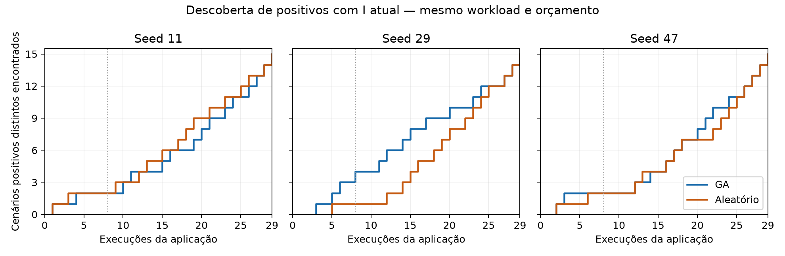

# Discovery speed with current I

The user-approved follow-up asks whether GA discovers positive scenarios earlier than
the matched random policy. The selected workload, score definition, runtime and search
operators are unchanged. The [protocol](../../../../issues/2026-09-10-fixed-workload-ga/DISCOVERY-PROTOCOL.md)
fixes seeds 11/29/47, population 8 and budget 29 per arm before new outcomes.

## Complete reference map

[reference.json](reference.json) retains all 29 candidate keys and their measured reports:
21 reused keys from the previous current-runtime qualification and eight newly executed
keys. There are **15 I=2 cases and 14 I=0 cases**. All newly executed cases have complete
I assessments and complete read coverage within the declared scope; A=0.

All positives fail RemoveTournament's final removal step after its Quiz has already
been deleted. I counts the active Tournament with a deleted dependency and the Quiz
whose deletion survives the failed operation's recovery. The three canonical fault
vectors are `00100`, `00101` and `00110`, with six, six and three recovery variants.
The other nine vectors have only I=0 variants. These 15 positive scenarios are different
histories exposing the same partial-removal problem, not 15 independent defects.

The reference map is used only for evaluation. Search arms obtain new application
measurements; the scoring table is never passed into their decision process. Primary
coverage targets are 8/15 (at least 50%), 12/15 (80%) and 15/15 (all positives).

## Comparison and artifacts

The completed campaign made **182 new application executions**, all with complete I
assessments and read coverage within scope. GA/random needed 20/18, 15/20 and 20/22
executions to find eight positives in seeds 11, 29 and 47 respectively. They needed
26/25, 24/25 and 26/26 to find twelve. Every arm found all fifteen at execution 29.
The [full results](../../../../verifiers/experiments/fixed-workload-ga/DISCOVERY-RESULTS.md)
include the interpretation and exact lineage examples.

Blue is GA, orange is random; the dotted line ends initialization at execution eight.
[summary.json](summary.json) is the independently checked campaign index. Vector and
exportable figure versions are available as [SVG](discovery-curves.svg) and
[PDF](discovery-curves.pdf). Only 14 of 63 later GA executions were new crossover children;
ten were positive. The other 49 used random exploration. No duplicate was re-executed
within an arm, and no arm stopped early. The results are mixed across seeds.

The comparison retains each arm's actual execution count and stop reason. A missing target
remains unachieved; it is not assigned a fictional execution count of 29. The curves show
positive discoveries after each real application execution, with the initial population
boundary at execution 8. Duplicate proposals consume CPU/generation time, not an additional
application execution. Both cost types remain available.

Raw artifacts: `verifiers/target/fixed-workload-ga/discovery-01/`.
Use `discovery_analysis.py` from the experiment directory to validate the campaign and
reproduce `summary.json` plus PNG/SVG/PDF curves from the completed arms. Results are interpreted
against this finite workload and current I; changing the feedback requires reassessing
the reference under the new definition.
